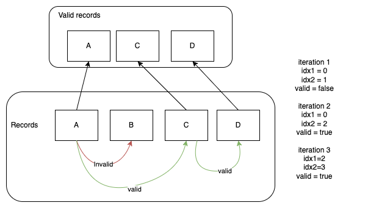
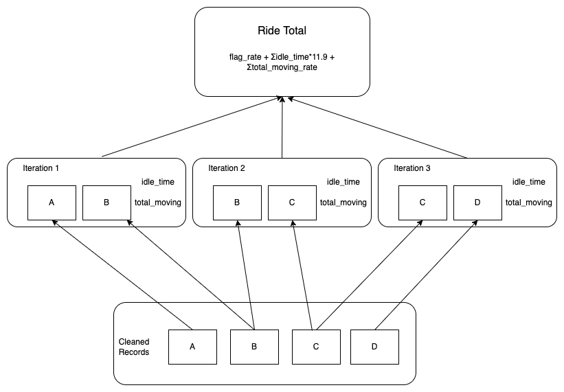

# Fare estimation

## Overview

This program has two main functions

- clean_data(): cleans the paths.csv before rate calculation and creates a filtered.csv file

- calculate_rates(): takes filtered.csv file and does the rates calculation and creates a rates.csv as output

### How does it work?

**clean_data():** The main loop of the program uses a two indexes iteration to check if a segment A-B is valid, if point B is invalid skips it and try with another segment A-C

**calculate_rates():** Similar to the perform_clean_data function, it calculates the total moving km and idle time using two indexes that are incremented at the same time after evaluating a segment. When all the segments were evaluated it aggregates all the segments subtotals into a grand total

Note: both functions iterate over the full dataset only one time

## Initial requirements

python >= 3.9

  

## Setup

1. install poetry to manage dependencies

> pip install poetry

2. install dependencies

> poetry install

3. activate virtualenv
> poetry shell

4. put your paths.csv in the root of the project

5. run the program

> python main.py

  

You will find 2 files as output

- filtered.csv: file with the filtered dataset

- rates.csv: the final output with the calculated rates

  
  

## Running the tests

> pytest .

  

## Extras

- lint code:

> black .